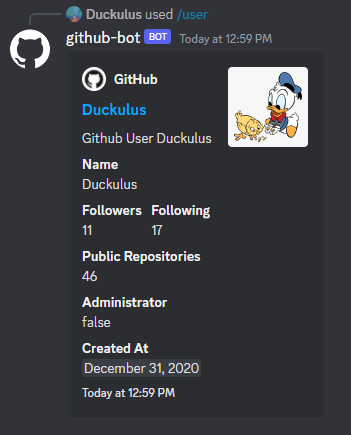

# `github-bot`

This is a WIP discord bot that fetches data from GitHub's [Rest Api](https://docs.github.com/en/rest) and embeds it into Discord messages

## Example

## Usage

Invite the [Official Bot](https://discord.com/api/oauth2/authorize?client_id=1076100766961508352&permissions=0&scope=bot%20applications.commands) to your server or host it yourself using the [Docker Image](https://hub.docker.com/repository/docker/duckulus/github-bot/)